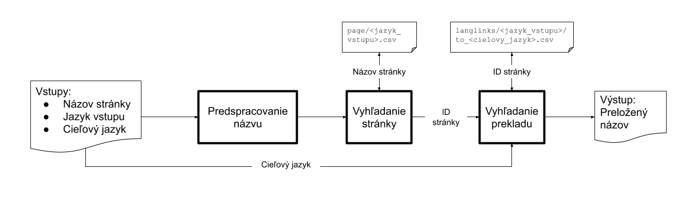

# Vyhľadávanie informácií, FIIT STU, ZS2020/2021
Repozitár na projekt z predmetu Vyhľadávanie informácií.
## Téma

Parsovanie Language Links z SQL alebo DBPedia a štatistika. Overenie
back links a štatistika. Aspoň 3 jazyky.

## Spustenie

Na spustenie je potrebné mať nainštalovaný Python 3.8.

Postup:

1.  Naklonovať/stiahnuť tento repozitár
2.  Stiahnuť a rozbaliť SQL dumpy do priečinka
    `<repozitar>/wikipedia_dumps`. (page: [cs](https://dumps.wikimedia.org/cswiki/latest/cswiki-latest-page.sql.gz), [fi](https://dumps.wikimedia.org/fiwiki/latest/fiwiki-latest-page.sql.gz), [sk](https://dumps.wikimedia.org/skwiki/latest/skwiki-latest-page.sql.gz), langlinks: [cs](https://dumps.wikimedia.org/cswiki/latest/cswiki-latest-langlinks.sql.gz), [fi](https://dumps.wikimedia.org/fiwiki/latest/fiwiki-latest-langlinks.sql.gz), [sk](https://dumps.wikimedia.org/skwiki/latest/skwiki-latest-langlinks.sql.gz))
3.  Nainštalovať závislosti: `pip install -r requirements.txt` v
    koreňovom priečinku repozitára.
4.  Spustenie jednotlivých skriptov. Každý skript má prepínač `-h`,
    ktorý vypíše pomoc a použitie daného skriptu.
    1.  Parser - `python parser.py` - pre správne fungovanie ostatných
        skriptov treba tento spustiť aspoň raz
    2.  Vyhľadávač - `python searcher.py`
    3.  Štatistiky a overenie backlinks - `python stats.py`

## Dáta

V rámci projektu budeme parsovať SQL dumpy z wikipedie. Pre získanie
názvov článok potrebujeme tabuľku `page` a pre samotné language links
tabuľku `langlinks`. Rozhodli sme sa parsovať slovenskú, českú a fínsku
wikipediu. SQL dumpy slovenskej wikipedie majú 287 (langlinks) a 59
(page) MB. Českú wikipediu sme zvolili pretože medzi SK a CZ wikipediou
očakávame veľa prekladov. Veľkosť dumpov je 400 (langlinks) a 146 (page)
MB. Fínsku wikipediu sme zvolili preto, lebo veľkosťou zapadá medzi
zvyšné dve (379MB langlinks a 144MB page).

### Tabuľka langlinks

Táto tabuľka obsahuje tri stĺpce:

  - `ll_from` - ID stránky z tabuľky `page` v aktuálnom jazyku - v
    langlinks skwiki teda ID článku v slovenčine,
  - `ll_lang` - kód jazyka, do ktorého je daná (napr. slovenská pre
    skwiki langlinks) stránka preložená,
  - `ll_title` - nadpis/názov preloženej stránky (v cieľovom jazyku).

Príklad dát:

`(72704,'af','Chemiese formule')`

Tento záznam reprezentuje odkaz na stránke slovenskej wikipedie s ID
*72704* (stránka [Chemický
vzorec](https://sk.wikipedia.org/wiki/Chemick%C3%BD_vzorec)), na stránku
*[Chemiese formule](https://af.wikipedia.org/wiki/Chemiese_formule)* v
jazyku *af*rikaans

Dáta na stiahnutie:
[cs](https://dumps.wikimedia.org/fiwiki/latest/cswiki-latest-langlinks.sql.gz)
|
[fi](https://dumps.wikimedia.org/fiwiki/latest/fiwiki-latest-langlinks.sql.gz)
|
[sk](https://dumps.wikimedia.org/skwiki/latest/skwiki-latest-langlinks.sql.gz)

### Tabuľka page

Táto tabuľka obsahuje 13 stĺpcov s informáciami o jednotlivých
stránkach. Pre náš projekt sa javia ako najdôležitejšie:

  - `page_id` - unikátne ID stránky, potrebné na prepojenie s tabuľkou
    `langlinks`,
  - `page_title` - nadpis stránky v jazyku, v ktorom je napísaná.

Príklad dát: ` 
(1,0,'Hlavná_stránka','sysop',0,0,0.321827921701,'20200920000102','20200919211529',7070047,7213,'wikitext',NULL)
 `

Na prvom mieste je ID stránky, nasleduje ID menného priestoru do ktorého
stránka patrí, názov stránky. Medzi ďalšie informácie patria privilégiá,
informácia o redirecte, počet návštev a podobné, ktoré pre nás nie sú
zaujímavé. Posledný stĺpec označuje kód jazyka, v ktorom je stránka
napísaná, tento je však v dátach často prázdny, čo však nie je problém,
keďže na slovenskej wikipédii sú stránky v slovenčine.

Dáta na stiahnutie:
[cs](https://dumps.wikimedia.org/fiwiki/latest/cswiki-latest-page.sql.gz)
|
[fi](https://dumps.wikimedia.org/fiwiki/latest/fiwiki-latest-page.sql.gz)
|
[sk](https://dumps.wikimedia.org/skwiki/latest/skwiki-latest-page.sql.gz)

## Návrh

Celý projekt bude rozdelený do viacerých častí: parser, vyhľadávač a
štatistiky. Každá z týchto častí bude samostatný skript. Ako prvý by sa
mal aspoň raz spustiť parser, ktorý spracuje surové dáta. So
spracovanými dátami bude pracovať vyhľadávač a budú sa z nich počítať
štatistiky. Implement8cia bude v jazyku python.

### Parser

Táto časť programu je zodpovedná za spracovanie SQL dumpov z wikipedie a
uloženie potrebných informácií z nich do vlastných súborov. Štruktúra
výsledných súborov je na obrázku.

Vstupné SQL súbory sa spracúvajú riadok po riadku. Spracúvajú sa len
riadky, ktoré sú insert statementy, teda začínajú textom `INSERT INTO`.
V každom riadku sa následne vyhľadajú jednotlivé záznamy, ktoré sú v
súbore uzátvorkované. Z každého záznamu sa vyberú informácie (pri pages
ID a názov stránky, pri langlinks ID a preložený názov), a zapíšu sa do
príslušného .csv súboru. Pri stránkach je jeden súbor pre každý z
vybraných troch jazykov. Pri langlinks existuje pre každý z troch
vstupných jazykov (cs, fi a sk) podpriečinok s vlastným súborom pre
každý z cieľových jazykov.

    for insert_statement in subor:
      for values in insert_statement:
        if pages:
          write (page_id, page_title) into "csv/page/{language}.csv"
        else:
          write (page_id, target_title) into "csv/langlinks/{language}/to_{target_language}.csv"

Na získavanie jednotlivých hodnôt z import statementov použijeme
knižnicu [parse](https://github.com/r1chardj0n3s/parse).

### Vyhľadávač

Vyhľadávač bude slúžiť na nájdenie inej jazykovej verzie zadanej
stránky. Vstupom od používateľa bude kombinácia názvu stránky, ktorý
chce preložiť, kód jazyka, v ktorom je zadaný názov a kód cieľového
jazyka.

Zadaný názov sa najprv predspracuje - minimálne sa vymenia medzery za
znak '\_' a upraví sa na malé písmená. Načíta sa tabuľka stránok
príslušného vstupného jazyka, v ktorej sa podľa názvu stránky vyhľadá
jej ID. V ďalšom kroku sa načítajú jazykové prepojenia pre príslušnú
dvojicu vstupného a cieľového jazyka, v ktorých sa následne vyhľadá
názov stránky v cieľovom jazyku podľa jej ID. Preložený názov je na
výstupe.

### Štatistiky

Táto časť bude slúžiť na počítanie rôznych štatistík pre jednotlivé tri
základné jazyky, ako napríklad priemerný počet preložených článkov do
iného jazyka, jazyk s najviac/najmenej prekladmi. Taktiež sa v tejto
časti budú overovať vzájomné prepojenia (backlinks) medzi jednotlivými
jazykmi. Vstupom bude jazyk, pre ktorý budeme chcieť získať štatistiky.

## Riešenie

Riešenie bolo implementované tak, ako je opísané v návrhu s niekoľkými
úpravami. Najvýraznejšou je použitie indexu. Pre vyhľadávanie ID
stránky podľa jej názvu v tabuľke `page` sa používa index z
pythonovskej knižnice
[Whoosh](https://whoosh.readthedocs.io/en/latest/index.html). Pre každý
zo základných jazykov (cs, fi, sk) sa pri parsovaní vytvorí samostatný
index. V indexe sa vyhľadáva podľa názvu stránky a ukladá sa doňho názov
aj ID stránky. Indexované názvy sa prevedú na malé písmená, odstráni sa
z nich diakritika a tokenizujú sa podľa regulárneho výrazu
`\w+(\.?\w+)*`, ktorý táto knižnica používa ako základný tokenizér.
Tento regulárny výraz nájde jednotlivé slová - skupiny alfanumerických
znakov a podčiarovníkov (\_).

Použitím takéhoto indexu sme nie len znížili časové a pamäťové nároky na
vyhľadanie ID stránky, ale tiež sme získali možnosť vyhľadania stránok
aj pri zadaní neúplného názvu, napríklad iba jedného zo slov
vyskytujúcich sa v názve stránky. Taktiež využívame index na ponúknutie
opravy dopytu v prípade, že by sa nenašla žiadna zodpovedajúca stránka.

Zmena je tiež v tom, že na výstupe môže byť viac názvov, pokiaľ zadanému
dopytu vyhovovalo viacero názvov stránok.

Pri štatistikách netreba zadávať jazyk, vypočítajú sa automaticky pre
všetky základné jazyky. Vo výstupe je tiež viac informácií oproti
návrhu. Pre každý zo základných jazykov je možné vypočítať:

  - celkový počet stránok,
  - počet duplicitných názvov stránok (v realite nemusí ísť o rovnaké
    stránky, môžu sa líšiť menným priestorom - namespace, ktorý v názve
    stránky v tabuľke `page` nie je uvedený),
  - názov stránky (stránok) s najviac duplikátmi,
  - najvyšší počet duplikátov,
  - počet jazykov, do ktorých existujú preklady,
  - priemerný počet prekladov do iného jazyka,
  - jazyk s najviac prekladmi,
  - najvyšší počet prekladov,
  - počty prekladov medzi jednotlivými základnými jazykmi,
  - 10 najčastejších termov v príslušnom indexe a ich collection
    frequency,
  - termy, ktoré sa v aspoň jednom dokumente (názve stránky) vyskytujú
    viac ako raz (collection frequency \> document frequency). Toto je
    zaujímavá informácia, keďže názov stránky je relatívne krátky text,
    viacnásobný výskyt termov sa neočakáva.

Pre každú kombináciu základných jazykov sa tiež zistia všetky také
stránky, ktoré dokážeme preložiť z jazyka A do jazyka B, no následne
nedokážeme nájsť preklad z jazyka B naspäť do jazyka A.

## Vyhodnotenie

Vytvorený systém umožňuje vyhľadanie a preklad názvov stránok z
Wikipedie z troch základných jazykov do viac ako 300 jazykov. Vyhľadanie
názvu stránky a jeho prekladu trvá rádovo sekundy (ak sú súbory uložené
na HDD).

Pri overovaní backlinks sme zistili, že nie pre všetky stránky platí, že
pokiaľ existuje preklad z jazyka A do jazyka B, tak existuje preklad aj
z jazyka B do jazyka A. Po bližšom skúmaní sme zistili, že na online
Wikipedii jazykové odkazy medzi týmito stránkami fungujú, no po
prehľadaní SQL dumpov sa ukázalo, že v nich chýbajú. Jedná sa však len
o malé percento stránok - najviac takto nefunkčných jazykových liniek je
pri preklade z fínčiny do slovenčiny a späť - 134. Celkovo je však z
fínčiny do slovenčiny preložených 85 189 stránok, čiže táto chyba je
menšia ako 0.01%. Niektoré backlinks nefungujú aj z toho dôvodu, že pod
rôznymi ID sú stránky s rovnakými názvami, pokiaľ však aspoň jedna z
týchto stránok preklad má, považovali sme to za úspešný scenár, nakoľko
k prekladu pojmu sme sa dostali.

Pri analyzovaní najčastejších termov z indexu sme zistili, že medzi
najčastejšie patrí pri každej wiki jej názov - cswiki, fiwiki a skwiki.
Tieto slová sa vyskytujú v tabuľke `page` na konci názvu za znakom \~. V
dokumentácii sme o ich význame nič nenašli, no domnievame sa, že ide o
názvy stránok používateľov, ktoré musia byť rozlíšené naprieč rôznymi
jazykovými mutáciami Wikipedie.

## Bonus
V rámci bonusovej úlohy sme riešili uloženie všetkých údajov v jednom indexe, bez potreby prehľadávania ďalších .csv súborov.
Dokument v tomto indexe obsahuje:
  - `original_title` - názov stránky v pôvodnom jazyku (jeden z hlavných jazykov) - pole analyzované ako text,
  - `translated` - preklad názvu - pole analyzované ako text,
  - `source_lang` - kód pôvodného jazyka - neanalyzované pole,
  - `target_lang` - kód jazyka prekladu - neanalyzované pole.
  
Takýchto dokumentov pri parsovaní šiestich SQL dumpov vznikne vyše 15 miliónov, na čo už knižnica whoosh nestačí (samotné 
vytvorenie indexu by trvalo minimálne 9 hodín), preto sme sa rozhodli tento index vytvárať s pomocou Elasticsearch.
V indexe sa používa upravený štandardný analyzér, ktorý okrem prevodu vstupu na malé písmená a rozdelenia na tokeny
odstráni zo vstupu diakritiku.

Parsovanie prebieha podobne ako v pôvodnom riešení - prvý krok je rozdelenie SQL dumpov na menšie .csv súbory, ktoré je možné 
postupne spracovať. Po vytvorení týchto súborov sa začne vytváranie Elasticsearch indexu.
Pre každý zo základných jazykov sa zo súborov načítjú všetky preklady, pridá sa k nim pôvodný názov a jazykové kódy. 
Takto vytvorené dokumenty sa následne indexujú pomocou Elasticsearch Bulk API.

Vyhľadávanie je jednoduché: pre zadaný vstup a jazyky sa vyskladá dopyt, ktorý vyhľadá zadaný názov v poli `original_title` a
súčasne musia sedieť kódy jazykov. Zaujímavosťou je, že takýto index nám dal možnosť prekladať stránky aj zo všetkých 
nájdených jazykov do troch hlavných. V tomto prípade sa dopytujeme na názov v poli `translated`, jazyk vstupu v poli `target_lang`
a požadovaný jazyk v poli `source_lang`.
